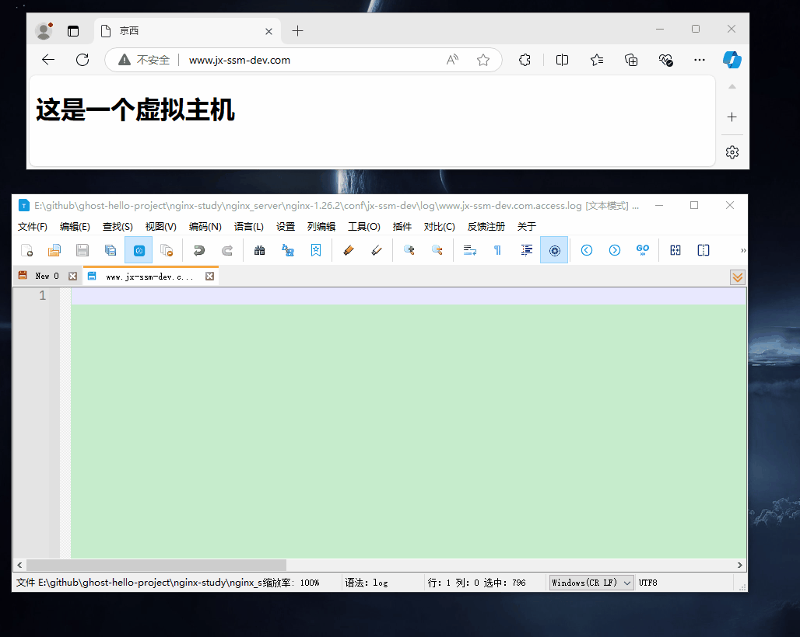

# 基本使用

## 最小化配置

```conf {.line-numbers}
#允许进程数量，建议设置为cpu核心数或者auto自动检测，注意Windows服务器上虽然可以启动多个processes，但是实际只会用其中一个
worker_processes  1;

events {
    # 单个进程最大连接数（最大连接数=连接数*进程数）
    # 根据硬件调整，和前面工作进程配合起来用，尽量大，但是别把cpu跑到100%就行。
    worker_connections  1024;
}

http {
    # 文件扩展名与文件类型映射表(是conf目录下的一个文件)
    include       mime.types;
    # 默认文件类型，如果mime.types预先定义的类型没匹配上，默认使用二进制流的方式传输
    default_type  application/octet-stream;

    # sendfile指令指定nginx是否调用sendfile 函数（zero copy 方式）来输出文件，对于普通应用，必须设为on。
    # 如果用来进行下载等应用磁盘IO重负载应用，可设置为off，以平衡磁盘与网络IO处理速度。
    sendfile        on;

    # 长连接超时时间，单位是秒
    keepalive_timeout  65;

    # 虚拟主机的配置
    server {
        # 监听端口
        listen       80;
        # 域名，可以有多个，用空格隔开
        server_name  localhost;

        # 配置根目录以及默认页面
        location / {
            root   html;
            index  index.html index.htm;
        }

        # 出错页面配置
        error_page   500 502 503 504  /50x.html;
        # /50x.html文件所在位置
        location = /50x.html {
            root   html;
        }
    }
}
```

## 基本的虚拟主机配置

### hosts
```
127.0.0.1 www.jx-ssm-dev.com
```

### 主配置文件
```conf {.line-numbers}
#允许进程数量，建议设置为cpu核心数或者auto自动检测，注意Windows服务器上虽然可以启动多个processes，但是实际只会用其中一个
worker_processes  1;

events {
    # 单个进程最大连接数（最大连接数=连接数*进程数）
    # 根据硬件调整，和前面工作进程配合起来用，尽量大，但是别把cpu跑到100%就行。
    worker_connections  1024;
}

http {
    # 文件扩展名与文件类型映射表(是conf目录下的一个文件)
    include       mime.types;
    # 默认文件类型，如果mime.types预先定义的类型没匹配上，默认使用二进制流的方式传输
    default_type  application/octet-stream;

    # sendfile指令指定nginx是否调用sendfile 函数（zero copy 方式）来输出文件，对于普通应用，必须设为on。
    # 如果用来进行下载等应用磁盘IO重负载应用，可设置为off，以平衡磁盘与网络IO处理速度。
    sendfile        on;

    # 长连接超时时间，单位是秒
    keepalive_timeout  65;

    # 虚拟主机的配置
    server {
        # 监听端口
        listen       80;
        # 域名，可以有多个，用空格隔开
        server_name  localhost;

        # 配置根目录以及默认页面
        location / {
            root   html;
            index  index.html index.htm;
        }

        # 出错页面配置
        error_page   500 502 503 504  /50x.html;
        # /50x.html文件所在位置
        location = /50x.html {
            root   html;
        }
    }

    # 引用其他配置文件, 可以是相对路径或绝对路径
    include jx-ssm-dev/*.conf;
}
```

### 子配置文件
```conf {.line-numbers}
server {
    listen       80;
    server_name  www.jx-ssm-dev.com jx-ssm-dev.com;

    # 访问日志
    # combined 意为使用默认的日志格式
    access_log E:/projectpath/jx-ssm-dev/log/www.jx-ssm-dev.com.access.log combined;

    location / {
        root   E:/projectpath/jx-ssm-dev/html;
        index  index.html index.htm;
    }

    # 出错页面配置
    error_page   500 502 503 504  /50x.html;
    # /50x.html文件所在位置
    location = /50x.html {
        root   E:/projectpath/jx-ssm-dev/html;
    }
}
```

### 效果


## 反向代理

### 反向代理 spring boot

#### 最简单的配置

```conf {.line-numbers}
#允许进程数量，建议设置为cpu核心数或者auto自动检测，注意Windows服务器上虽然可以启动多个processes，但是实际只会用其中一个
worker_processes  1; 

events {
    #单个进程最大连接数（最大连接数=连接数*进程数）
    #根据硬件调整，和前面工作进程配合起来用，尽量大，但是别把cpu跑到100%就行。
    worker_connections  1024;
}

http {
    #文件扩展名与文件类型映射表(是conf目录下的一个文件)
    include       mime.types;
    #默认文件类型，如果mime.types预先定义的类型没匹配上，默认使用二进制流的方式传输
    default_type  application/octet-stream;

    # sendfile指令指定nginx是否调用sendfile 函数（zero copy 方式）来输出文件
    # 对于普通应用，必须设为on。如果用来进行下载等应用磁盘IO重负载应用，可设置为off，
    # 以平衡磁盘与网络IO处理速度。
    sendfile        on;
    
     #长连接超时时间，单位是秒
    keepalive_timeout  65;

    # spring boot 后端
    server {
        listen 80;
        server_name api.thresh-dev.com;

        location / {
            proxy_pass http://localhost:8092;
            proxy_set_header Host $host;
            proxy_set_header X-Real-IP $remote_addr;
            proxy_set_header X-Forwarded-For $proxy_add_x_forwarded_for;
        }
    }
}
```

#### 关于 docker 反向代理 spring boot 的几个问题

1. 本地开发环境如何反向代理
```
proxy_pass http://host.docker.internal:8092;
```

2. 非本地环境如何反向代理
**在同一个网络**
```
proxy_pass 服务名;
```

**不在同一个网略**
```
proxy_pass http://ip:端口;
```

## 负载均衡

### windows 下负载均衡小案例

### docker 环境下负载均衡

## 动静分离

### windows 环境下动静分离

### docker 环境下动静分离

## 防盗链

## 高可用

